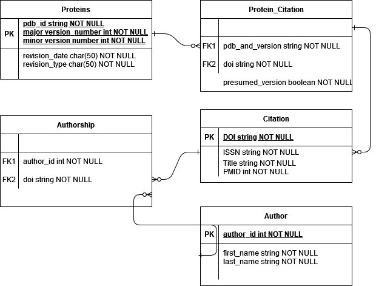

# Project Proposal 
> Meg Anderson
> 
> Professor Elizabeth Hobbs 
> 
> EN.605.652.81 : Biological Databases and Database Tools 

## High Level Project Objectives
PDB has a versioning system for protein structures that allows for a major version increase if there are changes to atomic coordinates, polymer sequences, or chemical descriptions. Such updates occur frequently, especially for proteins with structures previously studied using only one method.

Therefore, I would like to know who has cited a specific protein structure and which version they referenced. My basic needs as a user include the ability to submit a new citation for a protein structure in PDB, query previous citations, and potentially notify previous citation holders when there is a major version update to their protein structure.

## Issue Addressed 

The issue I would like to address with my project is data integration. There is no obvious traceability between a protein structure and the work derived from it. The most obvious field of relevance here would be drug discovery. Drug discovery oftentimes relies on designing binding compounds to some protein of interest. Predicting what will have affinity for a given protein is easier if you understand that protein's structure--which is hard to do if the originally reported atomic coordinated of the protein were incorrect. Authors who derived work from incomplete protein structures may benefit from repeating their experimentation in light of the revised structure, and those seeking to understand the field may benefit from examining work derived from older protein structure versions with caution. 

## Database Scope 

My database will include the following tables and fields:

My database will be populated with information from:
- PDB, which will provide data on protein versioning and original citation details
- Google Scholar, which I will use to find literature that either references the original protein, or cites the original published structure
- PubMed, which will fulfill a similar role as Google Scholar, but with a nicer interface through EUtils.  
This data will be scraped programmatically through a python script, which will act as a client to the API I will build to interact with my database. 

## Endpoints and User Requirements 

I intend for my final deliverable to be a rest API with the following endpoints: 
- `GET /proteins/{pdb_id}/citations` : used to view all scraped literature associated with any version of a given protein 
- `GET /proteins/{pdb_id}/versions/{version_number}/citations` : used to view all scraped literature associated with a given version of a given protein
- `POST /proteins/{pdb_id}` : used to enter a new protein in the database
- `POST /proteins/{pdb_id}/versions` : used to enter a new protein version
- `POST /proteins/{pdb_id}/versions/{version_number}/citations?notify={true|false}` : used to enter a new citation in the database. This endpoint will also attempt to notify the author of the citation if the citation is not for the most recently released version based on the query param "notify" 
- `GET /citations/{issn}/proteins` : a helper endpoint, which gives all of the proteins referenced by some citation
- `GET /citations?title={title_search}` : a generic query endpoint for the citations in the database, with all stored fields available as query params (title shown her for example)

The above endpoints, collectively allow for answers to the questions:
- Which literature references this protein? 
- Which literature cites this version of this protein? 
- Does this article cite the most recent version of this protein? 

All of the `POST` endpoints will require authentication with the server, to prevent users from altering protein or citation information. Initially, the only authenticated clients will be myself and the web scraper. 

## Deliverables

Final deliverables will include:
- __REST API documentation__, through an OpenAPI spec.  
- __Web scraper script__ to populate database, working as a client of the server. This will be a python script because I'm most familiar with web scraping through Beautiful Soup in python. I actually expect this to be the most time consuming part of my project, as google does not love you programmatically scraping their results. 
- __Web server__, providing an API to access the information in the database. I will generate my service through an OpenAPI generator to provide a rudimentary front-end to provide a GUI. I intend to use Java Springboot for the web-server, because the Springboot OpenAPI generator is one of the most mature server implementations. 
- __The database itself__, probably mySql but almost certainly a relational database because my data lends itself to a relational database. No direct access will be available to clients, with all calls metered through the service
