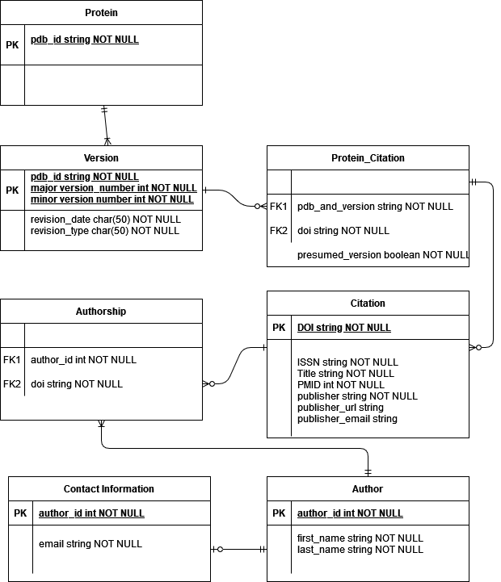
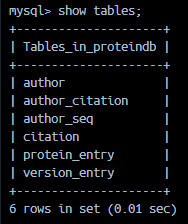
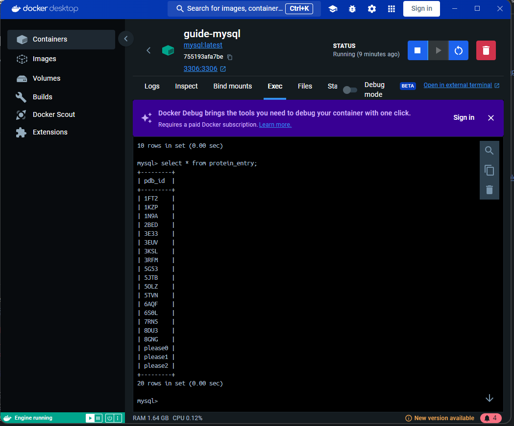
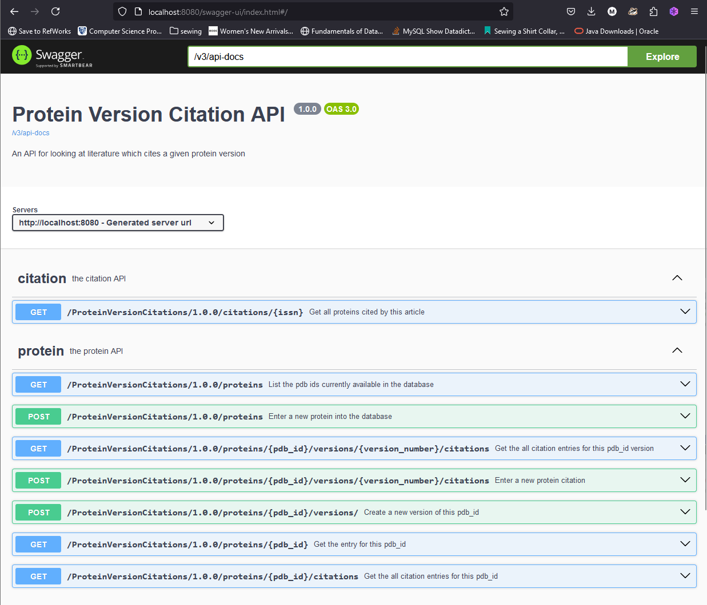
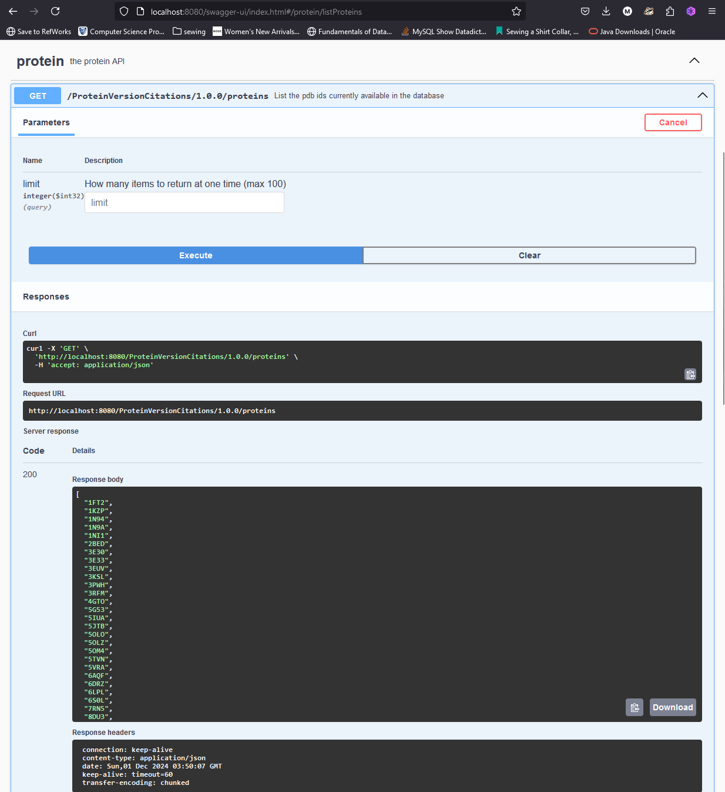
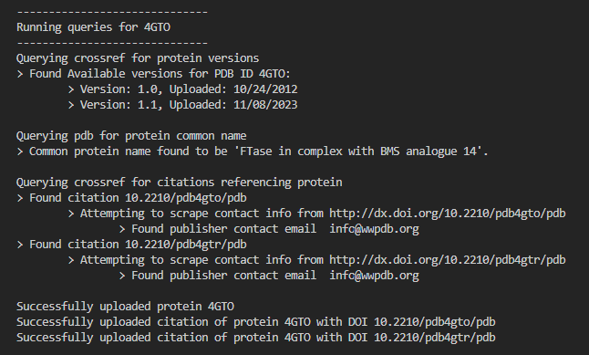
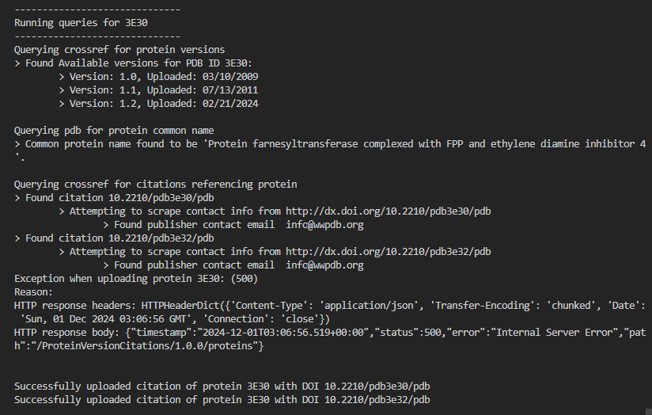
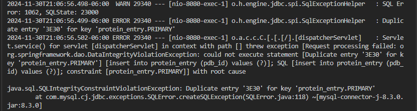

# Final Project Report 
> Meg Anderson
> 
> Professor Elizabeth Hobbs 
> 
> EN.605.652.81 : Biological Databases and Database Tools 
> 
# Introduction

PDB is the one of the largest repositories of molecular information on biological macromolecules, with a particular emphasis on proteins. PDB maintains both the atomic coordinates of proteins, and information on the experimental methods used to discover those coordinates. Experimental methods have radically changed since the inception of the PDB in 1971. This has lead to changes in the storage schema of proteins within PDB over time. 

One such change was the protein versioning system, announced in 2017. As protein spectroscopy and microscopy methods have improved, it has oftentimes been necessary to revise the original structure of proteins in the PDB.  Changes to the atomic coordinates, polymer sequence(s), and/or chemical identify of a ligand of a protein all constitute major revisions to the protein's entry. These changes can affect derived work, particularly in the case of drug discovery. Major revisions are changes to our understanding of the structure of a protein, and, as the adage goes, structure equals function. 

This version system allows a new set of atomic coordinates to be released for a protein while maintaining a link to the previous revision. Prior to this versioning system, major releases of proteins were released under new accession numbers. The previous version was then labeled obsolete. This system was not ideal, because older publications ended up with broken links to accession numbers which were now obsolete. This updated system allowed older publications to continue to link to the same accession number. However, the drawback of this system is users cannot easily tell which version of a protein the publication references. 

The purpose of this project is to create a link between a publication and the version of the protein they cited in their work. In this project, I have created a tool that links a publication with the protein version cited through a web-based API linked to a SQL database of protein version citation entries. My API addresses four major user needs. First, a user can understand the publications which have cited a particular version of a protein. Second, a user can see which version a publication cited. And third, a user can create new linkages between citations and their versions. Finally, the user can also attempt to notify authors if a new protein version is released. 

In service of these goals, I have also created a web scraper that queries the CrossRef API for mentions of a given protein (both by PDB ID and common name) and then predicts the version of the protein referenced based on publication date. I have initially populated my database using a set of PDB ids and my web scraper. 


# Related work

Finding prior art for this project was difficult. Much of my work was drawn from the original PDB versioning system. This versioning system was introduced to fix linkages between older versions of proteins and the publications which referenced them. The versioning system was introduced because it is insufficient to maintain only the latest release of a protein, as other work will continue to reference the older versions. 

However, as a computer scientist, I found it surprising this versioning system was only introduced in 2017. It is critical to track which software is in use on a system, particularly when there are frequent releases which may be incompatible with previous software revisions. When one piece of software relies upon another, that software is described as being dependant on the other. Similarly, scientific work may be considered as having dependencies: prior art that informs current experimentation.

Most scientific publications are informally linked to one another through a series of references. Citation systems oftentimes were designed for static information, such as print media. Electronic databases change far more often than printed sources, and oftentimes these citation system are inadequate to describe the state of an electronic resource at the time it was accessed. Software versioning systems were designed for the internet age, and help to solve this problem. PDB even chose to adopt semantic versioning as their version schema; a version system which originated from software development.

This makes my project novel for PDB, but it is drawn from best practices in industry software versioning. The primary inspiration for my project comes from the versioning system git. Git is a distributed version control system. Developers tag a unit of work as a "commit," which represents a unique item of work. It's easy to refer to a specific release of software by its commit, allowing developers to track exactly which version of the software was in use at some time. Git is now considered the standard version control system across the industry, having beat out several related version control systems. 

This project draws from the ubiquitous version control systems of software engineering, and applies it to the novel problem of protein citations. 


# Requirements

My system is designed to answer the following questions:
- Which literature references a given protein? 
- Which literature cites this version of this protein? 
- Does this article cite the most recent version of this protein? 

It also allows users to create new citations, and to attempt to contact the authors of an article in the event their citation is out of date. 

In service of these requirements, my server includes the following endpoints:

- `GET /proteins/{pdb_id}/citations` : used to view all scraped literature associated with any version of a given protein 
- `GET /proteins/{pdb_id}/versions/{version_number}/citations` : used to view all scraped literature associated with a given version of a given protein
- `POST /proteins/{pdb_id}` : used to enter a new protein in the database
- `POST /proteins/{pdb_id}/versions` : used to enter a new protein version
- `POST /proteins/{pdb_id}/versions/{version_number}/citations?notify={true|false}` : used to enter a new citation in the database. This endpoint will also attempt to notify the author of the citation if the citation is not for the most recently released version based on the query param "notify" 
- `GET /citations/{issn}/proteins` : a helper endpoint, which gives all of the proteins referenced by some citation
- `GET /citations?title={title_search}` : a generic query endpoint for the citations in the database, with all stored fields available as query params (title shown her for example)

I also provide a front-end to query all these endpoints and interact with the database. 


# Logical database design
My database includes the following tables and fields:



My database will be populated with information from:
- PDB, which will provide data on protein versioning and original citation details
- CrossRef, which I will use to find literature that either references the original protein, or cites the original published structure. This API is a change from my initial proposal. Originally, I intended to scrape Google Scholar for these results,. But the CrossRef API provided very similar functionality and prevented rate limiting. 
- The publisher's website, which provides contact information  
This data will be scraped programmatically through a python script, which will act as a client to the API I will build to interact with my database. 
 

# Database type

I used a MySQL database for this project. I chose this database for the following reasons:
1. My data is primarily entered in the database programmatically (ie, through my web scraper). Thus, it can follow a strict schema. NoSQL databases can be useful when you may introduce additional fields, or when some of your documents may hold additional sub fields. That doesn't apply to this situation. 
2. SQL databases generally have faster joins than NoSQL databases. Join tables were required for the /citation first endpoints, as information is indexed by protein, not citation. From the mongo db website, "MySQL is optimized for high performance joins across multiple tables that have been appropriately indexed," in comparison to Mongo, which supports joins, but is optimized for faster reads. 
3. For version 1 of the project, space was a consideration for the overall database. Maintaining a minimal schema allows for the project to be developed and deployed on smaller instances (read: my personal website). A SQL database allowed me to balance the rigidity of providing a minimal set of fields, with the flexibility of allowing users to perform ad-hoc queries on any those fields with reasonably high performance despite the space constraints. 


# Physical/Application design
 
My above ER diagram is translated near directly into the tables of the database. My final list of tables is: 



The primary deviation from my ER diagram is modeling the citation with the version embedded, rather than as a separate protein_citation table. The benefit of a separate protein_citation table would have been allowing a many-to-many mapping between the version and citation; this address the case where a given paper cites multiple proteins. In practice though, this use case did not occur in my test data, so I simply made the assumption that each citation would cite only one protein. I discuss this further in the future work section, as it would be a reasonable extension to the database long-term. 

Of the tables present in my database, all fields present in the ER diagram are in the final tables, with all fields from the protein_citation table migrated to the Citation table. 

# Test Plan
```
 Essentially this is an updated copy of your Discussion 12 post. Identify and explain several tests/inspections you used to verify your system is working (screenshots will be needed -- these go in the Implementation section). 

 ```

There are three categories of tests which I ran on my server:
- Sunny day cases. These are tests where the provided data is as expected, with no missing or incorrect fields. 
- Missing Data Cases. These are tests where some required field is not provided to to the server. 
- Incorrect Data Cases. These are tests where the information is provided, but the data does not follow the expected format. 

For my database, I tested both referential and entity integrity.  

Each is discussed in more detail below. 

## Sunny day cases
Sunny day tests represent when the client has provided correct input in an expected format. All endpoints were manually tested against sunny day cases through the Swagger UI. These manual tests ensured:
- Responses were correct
- Responses updated the database state 

## Missing data cases 
Missing data cases cover when a required piece of information is not provided. In the OpenAPI specification, each field in a schema can be labeled as required or optional: 

```openapi
    Error:
      type: object
      required:
        - code
        - message
      properties:
        code:
          type: integer
          format: int32
        message:
          type: string
```
Here, both the id and versions are required. 

Ultimately, these are translated on both the server and client as requirement annotations which are used by their respective data validators (pydantic for th4e scraper, jackson for hte sevrer.)

For example:

```python
class Error(BaseModel):
    """
    Error
    """ # noqa: E501
    code: StrictInt
    message: StrictStr
    __properties: ClassVar[List[str]] = ["code", "message"]
```

## Incorrect Data Cases
Incorrect data tests are for when a client provides information which adhreres to the expected type, but not the expected format. Some such validation is provided out of the box, such as for fields with formats defined in the Open API spec (EX. emails). 

For bespoke formats, such as DOIs, PDB Ids, and version numbers, I implemented custom validation. These checkers were invoked before any attempt to create new entries in the database, to ensure all information adhered to required formats.

For example, the function which handles the request to create protein citation invokes several validation functions:

```java
public ResponseEntity<Citation> createProteinCitation(String pdbId,
        String versionNumber,
        Citation citation) {

    if (!validPDBIdFormat(pdbId) || !validVersionNumberFormat(versionNumber) || !validCitation(citation)) {
        return new ResponseEntity<>(HttpStatus.BAD_REQUEST);
    }

    // .. additional business logic
}

```
The validation functions: 
``` java 
private boolean validVersionNumberFormat(String versionNumber) {
    if (versionNumber == null) {
        return false;
    }
    return VERSION_PATTERN.matcher(versionNumber).matches();
}

private boolean validPDBIdFormat(String pdbId) {
    // Reference for pdb Id format: https://www.rcsb.org/docs/general-help/identifiers-in-pdb
    // Could be altered to accept 8 letter codes, which is coming down the pipeline 
    if (pdbId == null || pdbId.length() != 4) {
        return false;
    }

    char firstChar = pdbId.charAt(0);
    if (!Character.isDigit(firstChar)) {
        return false;
    }

    for (int i = 1; i < 4; i++) {
        char c = pdbId.charAt(i);
        if (!Character.isLetterOrDigit(c)) {
            return false;
        }
    }

    return true;
}

private boolean validCitation(Citation citation) {
    return validDOI(citation.getDoi());
}

private boolean validDOI(String doi){
    if (doi == null) {
        return false;
    }
    return DOI_PATTERN.matcher(doi).matches();
}
```
These functions also do sanity checks for null values. 


## Malicious data 

Malicious data tests confirm that a user cannot directly manipulate the behavior or integrity of the server or database. This is the section I spent the least time on for my project, and further testing is discussed in the conclusion. 

I largely relied upon the deserialization frameworks of the server and scraper to prevent malicious information. Common attack vectors would be SQL injection attacks, and both frameworks prevent these attacks by ensuring the input data is validated against the expected types. 

On the server side it is checked through the jackson validation framework when the information is attempted to be deserialized into java objects. 

On the scraper side, it is checked through the pydantic framework or by directly parsing input values. Take for example the get_protein_versions function on the scraper side:

```python 
def get_protein_versions(pdb_id):
    print(f"Querying crossref for protein versions")

    url = f"https://data.rcsb.org/rest/v1/core/entry/{pdb_id}"
    try:
        response = requests.get(url)
        if response.status_code == 200:
            data = response.json()
            versions = data.get("pdbx_audit_revision_history", [])

            # Collect version details
            version_details = []
            for version in versions:
                date = version.get("revision_date", "N/A")
                if version.get("revision_date", "N/A") != "N/A":
                    date = parser.parse(date)
                version_info = {
                    "major_version": version.get("major_revision", "N/A"),
                    "minor_version": version.get("minor_revision", "N/A"),
                    "revision_date": date
                    # "description": version.get("description", "No description available")
                }
                version_details.append(version_info)

            return version_details
        else:
            print(f"Error: PDB ID '{pdb_id}' not found.")
            return None
    except Exception as e:
        print(f"Failed to retrieve version date from pdb id: {pdb_id}")
```

Here there are checks for the success of the call, but also that the received data matches expected type (ie, where we parse the date function). In all places where I pull data from the response body, I also provide default values for this information if it is missing. 

## Database Integrity Checks 
Database integrity checks are designed to ensure the information within the database maintains coherence. The JPA framework I used provided these integrity checks by translating the relations between objects into foreign key and entity constraints. An example of a violation of one of these integrity constraints is provided in the implementation section. 


# Implementation

 My system is implemented in four major parts:
 1. The web server
 2. The database
 3. The Swagger UI
 4. The web scraper 

The overall goal of my architecture was to use the client-server software pattern, allowing clients to interact with the database only through the mediation of a web server which translates and sanitizes the requests of the clients. 

In my implementation, I provide two such clients. One client is the swagger UI front-end, which allows users to manually query and interact with the database through a well-documented front-end. The web scraper is a programmatic client, designed to programmatically create search for and create citation information. 


## Web server 

### Springboot generated from OpenAPI generator
The web server is a Java Springboot web server generated through the OpenAPI Cli generator. 

To generate all components of my project I adhered to API first design. APIs, or Application Program Interfaces, can ve understood as contracts between servers and clients, in which the server informs a client of how it accepts inputs and the functionality it provides. Designing a system API first has the advantages of clarifying the communication between the server and clients in advance, preventing reworking and focusing testing.

The initial API for the server was defined using the OpenAPI specification. The OpenAPI Specification is used to describe HTTP APIs. Note: OpenAPI was originally based on the Swagger Specification, created in 2011. You may consider Swagger and OpenAPI interchangeable in the context of this paper. OpenAPI specs are both human and machine readable, and can be directly translated into code. The most common way of generating code from OpenAPI specifications is using the OpenAPI Generator, which has been implemented in many programming languages, providing both client and server implementations. 

For this project, I took advantage of the Java Springboot generator to create my server. Springboot is a modern Java web framework used across industry that provides automatic server configuration and dependency injection (and it's the framework I use at my day job). The springboot generator provides generated endpoints and model files, derived from the specification. Take, for example, the initial implementation of the createProtein
endpoint:

```java

    /**
     * POST /proteins : Enter a new protein into the database
     *
     * @param proteinEntry  (required)
     * @return Null response (status code 201)
     *         or unexpected error (status code 200)
     * @see ProteinsApi#createProtein
     */
    public ResponseEntity<ProteinEntry> createProtein(ProteinEntry proteinEntry) {
        // TODO
        return new ResponseEntity<>(HttpStatus.NOT_IMPLEMENTED);

    }
```

Out of the box, the class files for the ProteinEntry class exist. This code will build, run, and then throw a NOT_IMPLEMENTED error the first time a client calls this endpoint. An incredible amount is already present here, from the deserialization of the http request into java objects to sending back HTTP response codes. The majority of the codebase is actually generated, with minimal modification from me. The logic of my application is contained almost entirely within the `/server/src/main/java/org/openapitools/core/` package, which contains the implmentations of my delegate classes. The majority of my work was persisting the object to the database, the lgoci for which is not prescriptively defined in the generated code. 

### Java Persistance API (JPA)
To persist my Java objects to the database, I used a framework I had not previously: the Java Persistance API (JPA). The JPA is a specification that allows you to define how Java objects should be stored. 

For example, my ProteinEntry class is annotated as such:
```java
/**
 * ProteinEntry
 */
@Entity
@JsonTypeName("Protein_Entry")
@Generated(value = "org.openapitools.codegen.languages.SpringCodegen", date = "2024-11-03T20:23:08.570069800-06:00[America/Chicago]", comments = "Generator version: 7.9.0")
public class ProteinEntry {

  @Id
  private String pdbId;

  @OneToMany(mappedBy="protein", cascade = CascadeType.ALL)
  private List<VersionEntry> versions = new ArrayList<>();

  public ProteinEntry() {
    super();
  }

  // ..... many more getters and setters 

}

```
The `@Entity` annotation tells JPA that this class will ultimately be an entity or table in my persistance schema. The `@Id` annotation sets the pdbId field as the primary key of this entity. The `@OneToMany` annotation sets the relationship between proteins and their versions. 

To persist some given entity to the database, I define a Repository class. Shown here is the CitationRepository interface: 

```java
@Repository
public interface CitationRepository extends JpaRepository<Citation, String> {

        List<Citation> findAllByReferencedProteinVersionAndReferencedProteinVersion(ProteinEntry protein, VersionEntry version); 

}
```

These repositories automatically define save and find endpoints, and allow you define  additional functions; here the `findAllByReferencedProteinVersionAndReferencedProteinVersion` function allows me to look up citations by their protein and version. The JPA will automatically translate any custom functions to business logic dependant on the actual persistance mechanism used. My final database is a MYSQL database, thus, these functions are translated into a series of SQL statements. This allows me to avoid manually writing SQL queries (and avoiding introducing a fourth programming language into my project). 

Despite how straightforward this sounds, using the JPA was actually the most challenging part of my project. The save functions--used to actually write the objects to the database--have a poorly documented behavior in Spring. The save function actually works generically for both creates and updates. The Spring implementation distinguishes between whether a save should be an update or a create by whether the primary key is null. If the primary key is null, the implementation assumes this a new object that has not yet been assigned a key, and then creates a new object. The strange behavior is when your object already has a key (ie, the key is not null). Spring then assumes this object should simply be an update of an existing object already present in the database. This behavior is poorly suited to cases where the tables are indexed by a user provided primary key, such as the PDB id used in my protein table. This issue manifested as a consistent DuplicateObject error thrown by the SQL database. I spent hours hunting through documentation to discover the problem. Ultimately, I found a description of the problem, and a proposed solution on Stack Overflow. The solution was to overwrite the mechanism by which Spring decides whether to update or create an object by having my classes implement the `Persistable` interface. This allows me to control when an object is created new or updated. 


I do not regret learning how to use this framework, as it still allowed me to avoid manually writing SQL queries. Poor SQL queries can be a source of bottlenecks in a project, and too few developers are fluent in SQL programming for the number of us who write SQL queries. Even though I found the framework frustrating, I'm glad to have this tool in my toolbox going forward for other projects. Much of my initial code was based on a reference guide by Mkyong, in addition to the official documentation. 

Overall, the server meets many requirements for data validation and sanitization, helping to maintain the database's integrity. 

## Database 
For this project, I used a MySQL database. The database is deployed in a docker container, and is brought up simultaneously to the server through the use of a docker compose file. All of the strings to the server should be considered insecure, and are dummies on the github repo. 

This database was linked through the MySQL JPA connector, as referenced above. I did not have to write any direct SQL statements for this implementation. However, I can stile directly interact with the database as desired by issuing commands to its container. For example: 




The database meets the user need of long-term storage of linkages between citations and their protein versions. 

## The Swagger UI 
To interact with the database and server, I provide a swagger front-end web page. This is generated through a swagger plugin, and allows users to manually query information through a user friendly front-end. I imagine this front-end allowing users to manually enter their own citations, as it is human readable and easy to interact with. It also provides documentation on the available endpoints:



The information provided through the front-end is identical to that found by querying the database directly, but the "middleman" of the server allows for validation of requests to the database and prevents users from having direct access. As an example, here is the result of calling the `/proteins` endpoint. The list of proteins available from the database mirror those found by directly running a select in the database: 



The UI meets the user need of manually querying for information based on arbitrary fields. 

## Web scraper 
My web scraper is a python script that makes use of a few APIs and frameworks to scrape information about a given protein. The scraper can be conceptualized as a programmatic client ot my database. My database is currently populated with entries from the web scraper and a few manual test entries. 

The web scraper takes the following steps. 
1. Reads in the pdb Ids present in our homework SQLLite database
2. For each id: 
   1. Finds the common name of the protein from the RCSB api
   2. Finds the available versions of the protein from the RCSB api 
   3. Uploads the protein and its version to the server 
   4. Finds citations which reference the protein by Id or common name from the CrossRef API
   5. For each citation:
      1. Extracts information about the citation, including the publisher's website
      2. Predicts which version of the protein this citation references based on its publication date
      3. Makes a call to the publisher's website
      4. Extracts all `mailto` tags from the html code of the publisher's website in order to find contact information for the publisher. 
      5. Uploads the citation and the contact information to the server. 


It also provides output for each of these steps. Take the following "sunny-day" case output: 



In all screenshots attached here, the queries were limited to include a maximum of two citations by ID and two by common name to keep the output nicely on one page. Generally many more were found for each protein. 

In the event that there is an error in any call or in uploading the protein to the database, the program gracefully moves to the next protein or the next entry, as appropriate. As an example, in rerunning this script multiple times, I occasionally attempted to upload the same protein to the database multiple times. In the following output, you can see the output shows that the protein was not uploaded, and the server output confirms it was because the key was a duplicate. However, the citations had not previously been entered into the database, so they were entered despite the previous error: 



And the server output: 



The scraper meets the user need of having the database be initially populated with information, and providing sample data for queries. Additionally, it can be modified to input data for any set of PDB Ids, allowing a user to gain insights about some particular set of Ids. 

#  Conclusion and Future Work

## Future Work 
I would have implemented the following if I had more time to work on this project: 

1. I would have implemented more sophisticated validation on the provided fields. 

Currently, I provide validation for the pdb Ids, the DOIs, and the version numbers. This set of fields is a minimal set to maintain the integrity of the database. Other fields, however, are important to the coherence of the database. As an example, I do not sanity check the results returned from cross ref when you query by pdb Id and common name. The consequence of this is oftentimes results which are literal text matches to the ID are returned, even if that text match is coincidental and the publication has nothing to do with proteins. Some pdb Ids are even parsable as natural language words, making this a particularly difficult process. For this sort of validation, a contextual model would be better, but was out of scope for this project. 

2. I would have hosted my project publicly on my website.

Ultimately, I did not host my project because I would not publicly provide an API without implementing some form of rate limiting on the requests to the server. Otherwise, it makes it too easy for someone to bring down my website by making repeated calls to the API. The security concerns involved with hosting such an API publicly could take their own class. 

3. Providing an automated way of contacting the publication if a new version is released. 

I scrape the contact information for a publisher from their website. This is not a very sophisticated way of finding contact information, and I ultimately think a better implementation would be to create a hashed map of contact information in a separate table of the database. This would minimize the duplication of this information, and allow it to be manually entered / validated. 

Originally, I intended to scrape contact information for the authors directly, but I ultimately decided against this. Although the field exists, and can be manually filled out by a user, the web scraper does not automatically pull in this information. Automatically scraping contact information feels scammy; contacting the publications would be a politer mechanism, but I only decided this late into implementation. 

4. Automated contract testing through Rest Assured. 

Each endpoint was tested manually, but if I had more time I would have implemented contract / API testing through Rest Assured. This is the testing framework I use at work. However, these tests are time consuming to write, hence why they were not in scope for this project. Using an automated testing framework would have allowed me to make assertions on 
    - Response type
    - Response body
    - Response time (calls need to execute quickly to be usable)
    - Error responses 
I did lay the groundwork for contract testing my implementing test containers on my project, which start up a fresh MySQL database container on each test, creating a clean testing environment.  

## Conclusion

The purpose of my project was the link a publication to the version of a protein cited. The user need I identified was being able to trace back a citation to the version of the protein. Work derived from a protein's structure is deeply reliant on accurate protein structure estimations, particularly for drug discovery. Downstream work may be impacted by versioning of a protein, but, without this project, there is no easy way to identify derived work. 

In service of this goal, I created four unique software components:
 1. A web server
 2. A database
 3. A front-end website
 4. A web scraper 

Taken together, these components form a system which addresses this niche I found in the current biological database offerings. All of them are implemented using modern, enterprise-grade, software frameworks. This project is a solid foundation which I intend to fully productize and deploy after winter break. I am proud of how much I accomplished in this amount of time, as each component offered its own challenges, and a web server of this type would generally be created over several sprints. 

I really enjoyed this course, and enjoyed working on this project. Thanks! 

# References

Baeldung. (2022, July). REST-Assured tutorial. Retrieved from https://www.baeldung.com/rest-assured-tutorial

Mkyong. (2023, Sept.). Spring Boot + Spring Data JPA + MySQL example. Retrieved from https://mkyong.com/spring-boot/spring-boot-spring-data-jpa-mysql-example/

MongoDB. (n.d.). Compare MongoDB and MySQL. MongoDB. Retrieved from https://www.mongodb.com/resources/compare/mongodb-mysql

OpenAPI Generator. (n.d.). OpenAPI Generator. Retrieved from https://openapi-generator.tech/

Postman. (n.d.). API-first approach with Postman. Retrieved from https://www.postman.com/api-first/

Semantic Versioning. (2014). Semantic versioning 2.0.0. Retrieved from https://semver.org/

Spring. (n.d.). Spring Boot project overview. Spring.io. Retrieved from https://spring.io/projects/spring-boot

Stack Overflow user adarshr. (2017, August). Spring JpaRepository save does not appear to throw exception on duplicate save [Answer]. Retrieved from https://stackoverflow.com/questions/40605834/spring-jparepositroy-save-does-not-appear-to-throw-exception-on-duplicate-save

Swagger. (2017, July). Data models and data types in OpenAPI 3.0. Swagger.io. Retrieved from https://swagger.io/docs/specification/v3_0/data-models/data-types/

Swagger. (2017, July). OpenAPI specification 3.0.0. Swagger.io. Retrieved from https://swagger.io/specification/

# Appendix A
## Data Dictionary. 


| Field Name              | Table Name         | Description                          | Field Type           | Source                                     |
|-------------------------|--------------------|--------------------------------------|----------------------|--------------------------------------------|
| pdb_id                  | Proteins           |The identifier for the protein from pdb. Unique within the PDB. Here used as a primary key. | string NOT NULL      | User provided or from web scraper         |
| major_version_number    | Versions        |The major semantic version number, representing a breaking change with a previous revision| int NOT NULL         | From RCSB API                             |
| minor_version_number    | Versions           |A minor semantic version number, which does not justify a major release| int NOT NULL         | From RCSB API                             |
| id    | Versions        | A derived unique ID, formatted as `<pdbId>_<majorVersion>_<minorVersion>` | string NOT NULL         |Programmatically generated                              |
| revision_date           | Versions           |The date the revision was released. Also used to guess the revision of the protein referenced in an article if none is provided. | char(50) NOT NULL    | From RCSB API                             |
| revision_type           | Versions           |An enumerated value from pdb describing the type of revision. Multiple enumerated values may be used, but are not stored separately for space| char(50) NOT NULL    | From RCSB API                             |
| pdb_and_version         | Protein_Citation   | A programmatically generated foreign key from the pdb_id and version | string NOT NULL | Programmatically generated                |
| doi                     | Protein_Citation   |Stands for "Digital Object Identifier". A UUID for online articles and documents. Here used as a foreign key. | string NOT NULL      | From CrossRef API                         |
| presumed_version        | Protein_Citation   |A boolean flag to highlight whether the referenced version is known, or presumed. All entries from the web scraper will be presumed, not known. | boolean NOT NULL     | Programmatically generated                |
| DOI                     | Citation           |Stands for "Digital Object Identifier". A UUID for online articles and documents. Here the primary key. | string NOT NULL      | From CrossRef API                         |
| ISSN                    | Citation           |Stands for "International Standard Serial Number." Used to represent continuing resources like journals. Another common resource identifier, included in this database for cross compatibility | string NOT NULL      | From CrossRef API                         |
| Title                   | Citation           |Open string field, can be used as a query field. | string NOT NULL      | From CrossRef API                         |
| PMID                    | Citation           |Stands for "PubMed ID." This field is how contact information is cross linked. | int NOT NULL         | From CrossRef API                         |
| publisher                    | Citation           | The string of the publisher. | string         | From CrossRef API                         |
| publisher_url                    | Citation           | The string of the publisher's website. | string         | From CrossRef API                         |
| publisher_contact                    | Citation           | Scraped url from the publisher's website's html tags  | string         | From BeautifulSoup scrapes of the publisher's website                         |
| author_id               | Author             | Programmatically generated primary key, as first and last name are not guaranteed unique.  | int NOT NULL       | Programmatically generated                |
| first_name              | Author             |Open string field, can be used as a query field. | string NOT NULL      | From CrossRef API                         |
| last_name               | Author             |Open string field, can be used as a query field. | string NOT NULL      | From CrossRef API                         |
| author_id (FK1)         | Authorship         |Foreign key to associate authors and articles | int NOT NULL         | Programmatically generated                |
| doi (FK2)               | Authorship         |Foreign key to associate authors and articles| string NOT NULL      | From CrossRef API                         |
